# CTp Processing Pipeline

<!--
**Author:** Rigoni Filippo  
**Contact:** flpp.rigoni@gmail.com
-->

This repository contains MATLAB code for processing CT perfusion (CTp) data. It provides an implementation of a pipeline that starts from raw DICOM files acquired in a VPCT series and computes quantitative parameter maps, including cerebral blood flow (CBF), cerebral blood volume (CBV), mean transit time (MTT), and time-to-maximum (TMAX). Different SVD‐based deconvolution algorithms are used to estimate residue functions.

The pipeline consists of the following sequential steps:

1. **DICOM Data Loading**  
   - Scan the designated directory for CT DICOM files.
   - Extract metadata such as slice locations, and acquisition times, and pixels spacing.

2. **Series Identification:**  
   - Identify the VPCT series from the available DICOM metadata.
   - Loading the DICOM data and converting to Hunsfield Units (HU).

3. **Volume Construction & Registration:**  
   - Assemble 2D slices into 3D volumes based on acquisition times and slice locations.
   - The pipeline includes a parameter named `upsample_factor` that controls the interpolation in the z-direction. Setting `upsample_factor` to a value greater than 1 increases the image resolution using either trilinear or spline interpolation. This upsampling improves registration quality at the expense of higher computational load.
   - Perform a two-step 3D rigid registration (volumes are registered relative to the first acquired volume):
     - **Downsampled Registration:** Downsampling is applied in the xy plane; obtain initial transformation estimates by registering lower-resolution versions of the volumes using Mutual Information.
     - **Full-Resolution Refinement:** Refine these transformations on the original high-resolution volumes, again using Mutual Information.

4. **Registration Parameter Extraction:**  
   - Extract translation and rotation parameters from the registration transformations.
   - Convert these parameters into millimeters and degrees to identify and exclude volumes with high motion.

5. **Skull Stripping & Mean Slices:**  
   - Compute average precontrast slices from the registered volumes.
   - Generate binary brain masks of the average precontrast volume using an automated skull stripping algorithm [1].

6. **Principal Axes Computation:**  
   - Apply PCA to the voxel coordinates of the brain mask to determine the principal anatomical axes.
   - Segment each slice into quadrants; this is importanr for isolating the posterior brain region during global VOF calculation.

7. **TCC Calculation & Outlier Removal:**  
   - Extract tissue concentration curves (TCCs) for each voxel and resample them to a common time base.
   - Convert TCCs to tissue attenuation curves (TACs) by subtracting the precontrast mean.
   - Perform voxel-wise linear regression to detect and remove outlier curves, updating the brain mask accordingly.

8. **AIF/VOF Detection and Scaling:**  
   - Compute the global Arterial Input Function (AIF) using a multi-step filtering and clustering approach [3].
   - Compute the global Venous Output Function (VOF) using a similar procedure; for the VOF, the cluster with the highest peak is selected rather than the one with the lowest first moment.
   - Use the VOF to scale the AIF, compensating for partial volume effects [4].

9. **Residue Functions and Perfusion Maps:**  
   - Compute voxel-wise residue functions using three distinct SVD-based deconvolution methods:
     - **sSVD:** A truncated SVD that applies a global threshold on the singular values.
     - **cSVD:** A block-circulant SVD method that applies a global threshold on the singular values.
     - **oSVD:** A block-circulant SVD method that uses an adaptive, voxel-specific oscillation index as the truncation threshold.
   - Generate perfusion maps (CBF, CBV, MTT, TMAX) from the computed residue functions [2].
   - Apply a standardized colormap (SIEMENS CT, ASIST Japan [7]).

Due to data privacy restrictions, only the code (and anonymized sample images) are provided in this repository.

## Directory Structure

```
CTp_matlab/
├── main.m                % Main script controlling the CTp processing pipeline
├── loadDicomData.m       % Loads DICOM data and extracts metadata
├── getVPCTDescription.m  % Extracts the VPCT series description from metadata
├── loadVPCTImages.m      % Loads VPCT images and retrieves pixel spacing
├── fillNaNPixels.m       % Fills missing pixel spacing values
├── sortImages.m          % Sorts images by slice and time
├── applyGaussianFilter.m % Applies Gaussian filtering for noise reduction
├── constructVolumes.m    % Assembles 2D slices into 3D volumes
├── upsampleVolumes.m     % Upsamples volumes in the z-direction using spline interpolation
├── registerVolumes.m     % Performs 3D rigid registration on volumes
├── extractRegistrationParams.m  % Extracts translation and rotation parameters from registration transforms
├── plotRegistrationParameters.m % Plots registration parameters over time
├── correctImagePositioning.m    % Adjusts slice ordering post-registration
├── displayVolumes.m      % Displays original versus registered volumes
├── performSkullStripping.m % Computes mean slices and generates brain masks
├── computePrincipalAxes.m  % Computes principal axes via PCA on brain masks
├── calculateTCCs.m       % Calculates Tissue Concentration Curves (TCCs) with outlier removal
├── computeGlobalAIF.m    % Computes the global Arterial Input Function (AIF)
├── computeGlobalVOF.m    % Computes the global Venous Output Function (VOF)
├── computeResidueFunctions_sSVD.m  % Computes residue functions using sSVD deconvolution
├── computeResidueFunctions_cSVD.m  % Computes residue functions using cSVD deconvolution
├── computeResidueFunctions_oSVD.m  % Computes residue functions using oSVD deconvolution
├── computePerfusionMapsAll.m       % Computes and displays perfusion maps (CBF, CBV, MTT, TMAX)
└── docs/                % Contains sample images and extended documentation
    ├── PrincipalAxes_LR.png         % Left-right principal component image
    ├── PrincipalAxes_TB.png         % Top-bottom principal component image
    ├── GlobalAIF_voxels_slice1.png    % AIF voxel locations on a representative slice
    ├── GlobalVOF_voxels_slice1.png    % VOF voxel locations on a representative slice
    ├── AIF_VOF_Scaled.png             % Scaled AIF and corresponding VOF curve plot
    ├── CBF_slice.png                  % Perfusion map for CBF on a representative slice
    ├── CBV_slice.png                  % Perfusion map for CBV on a representative slice
    ├── MTT_slice.png                  % Perfusion map for MTT on a representative slice
    └── TMAX_slice.png                 % Perfusion map for TMAX on a representative slice
```
## Requirements

- **MATLAB:** Version 24.2
- **Image Processing Toolbox:** Version 24.2
- **Statistics and Machine Learning Toolbox:** Version 24.2
- **Parallel Computing Toolbox:** Version 24.2
- **Brain Extraction from CT and CTA Images** (available in the MATLAB Add-Ons, [1])

## How to Run the Code

At present, sample data are not provided because I do not have the rights to share them. However, you can inspect the code to understand the CT perfusion processing pipeline. To explore the code:

1. **Start with the Main Script:**  
   Open the `main.m` file in MATLAB. This file serves as the entry point.
   
3. **Review the Function Files:**  
   Browse through the repository to view the individual function files (e.g., `loadDicomData.m`, `registerVolumes.m`, `calculateTCCs.m`, etc.). These files contain detailed implementations of each processing step.

4. **Future Data Availability:**  
   When sample data become available, you will be able to run the code. For now, the repository is intended for code inspection and review.

## Visual Documentation

Since the original data cannot be shared due to privacy concerns, the sample images below have been provided to illustrate key outputs of the processing workflow. Please note that in this visual documentation results from the brain segmentation step onward are presented.

<!--
### Registration Parameters

The registration process yields important motion parameters that quantify the translation and rotation between volumes. The following images illustrate these metrics:

- **Motion (Translation in Millimeters):**  
  This image shows the measured translation (in mm) over time.
  

- **Rotation (Angle in Degrees):**  
  This image displays the rotation angles (in degrees) computed during registration.
  
  -->

### Brain Skull Segmentation

Skull stripping is performed to generate brain masks from the mean pre-contrast slices, and an overlay is created that displays these masks in red on the corresponding slices [1]. An overview of the results:

  <div align="center">
    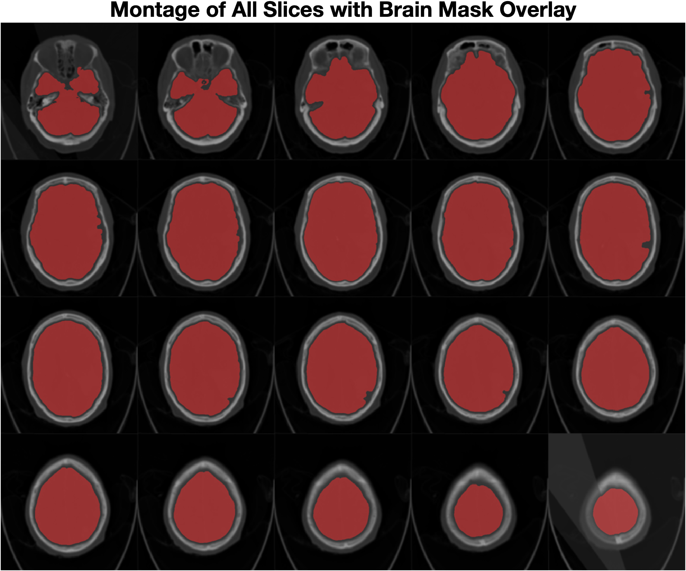
  </div>
  
### Principal Axes

The following images present the principal anatomical axes computed for brain segmentation. 

- **Left-Right Plane:**  
  <div align="center" style="margin:0; padding:0;">
    
  </div>
- **Front-Back Plane:**  
  <div align="center" style="margin:0; padding:0;">
    
  </div>
<!--
- **Top-Bottom Plane:**  
  <div align="center" style="margin:0; padding:0;">
    
  </div>
-->

<!--
### Outliers Detection using Linear Regression

This step employs voxel-wise linear regression on the tissue concentration curves (TCCs) to identify voxels affected by artifacts—such as those resulting from imperfect brain segmentation, head motion, or registration errors. Voxels with a slope exceeding 0.4 and an R² value above 0.6 are flagged as outliers and subsequently removed from the analysis. The figure below illustrates the voxels detected by this method, ensuring that only reliable data contribute to the final perfusion calculations.


-->

### Tissue Attenuation Curves
Tissue Attenuation Curves (TACs) are calculated subtracting the mean from the pre-contrast volumes. The figure below shows a representative TAC from one slice, illustrating the typical temporal behavior of the tissue signal. Both the original (blue) and fitted curve (red) are displayed. 

<div align="center">
   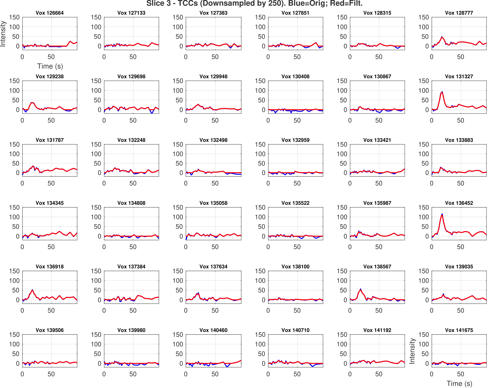
</div>

### AIF and VOF Voxels

- **AIF Voxels:** For each slice, the red overlay highlights voxels that were automatically classified as contributing to the global AIF. The overlay is superimposed on the baseline CT image, illustrating the spatial distribution of AIF candidate voxels for each slice.
  
<div align="center">
   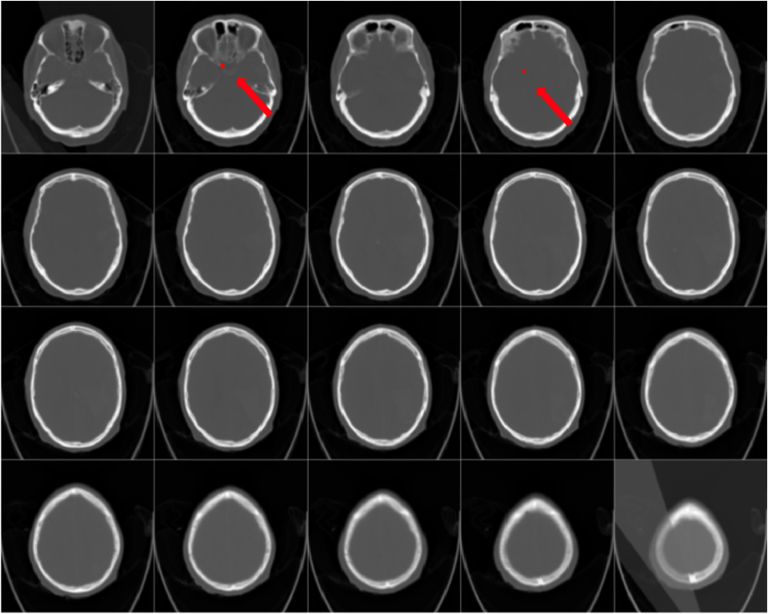
</div>

- **VOF Voxels:** For each slice, the blue overlay highlights voxels that were automatically classified as contributing to the global VOF. The overlay is superimposed on the baseline CT image, illustrating the spatial distribution of VOF candidate voxels for each slice.
<div align="center">
   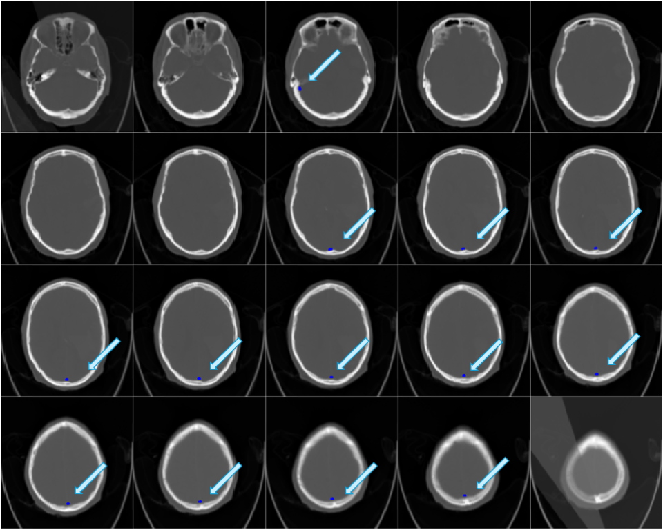
</div>

### AIF/VOF Scaling

- **Scaled AIF and VOF Plot:** This figure displays the unscaled AIF, the VOF, and the AIF scaled using the VOF. It clearly demonstrates the effect of VOF-based scaling on the AIF curve, with peak markers indicating the maximum values of each curve.
  
  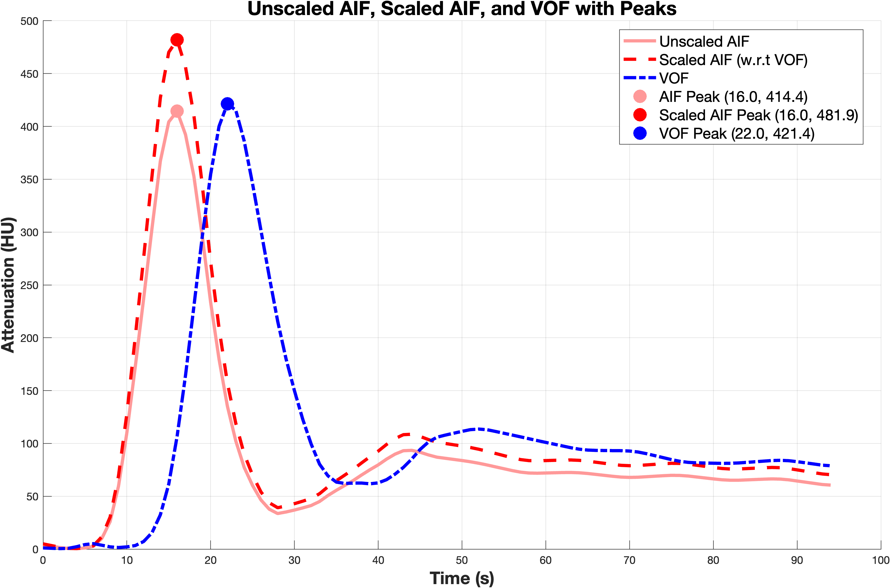

### Residue Functions

<!--
Residue functions are computed using the deconvolution methods applied to the TACs (presented above) along with the AIF scaled by the VOF (presented above). These residue functions represent the tissue response derived from the TACs, providing insight into the tissue dynamics following contrast administration. The images below illustrate the residue functions derived using the sSVD and cSVD methods.
-->

Residue functions are computed using the deconvolution methods applied to the TACs along with the AIF scaled by the VOF. Although the code calculates residue functions using sSVD, cSVD, and oSVD, only the sSVD and cSVD results are presented here. These functions provide insight into the tissue response dynamics following contrast administration.

- **sSVD Residue Functions:**  
  <div align="center">
    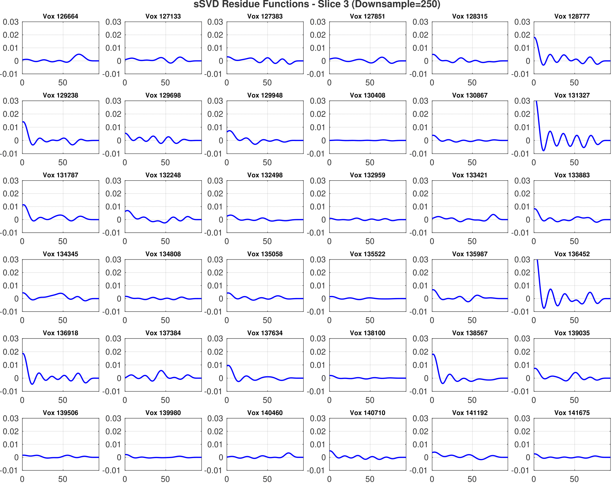
  </div>

- **cSVD Residue Functions:**  
  <div align="center">
    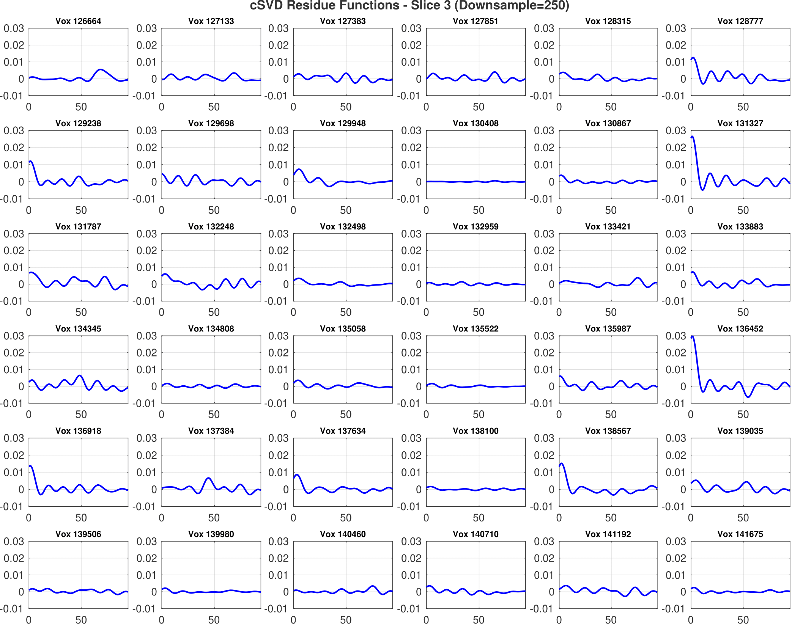
  </div>


### Perfusion Map Montages by Parameter

The code computes perfusion maps using three deconvolution methods. However, only the results from the sSVD and cSVD methods are presented here. For each perfusion parameter (CBF, CBV, MTT, and TMAX), the montage for the sSVD method is shown first, followed by the montage for the cSVD method.  
*Note:* The first and last slices may contain artifacts. During 3D registration, some boundary points are extrapolated by MATLAB's `imwarp` function; values outside the actual volume are set to 0, making these slices less reliable.

<!--
The following montages provide an overview of each perfusion parameter across all slices, grouped by parameter. For each parameter (CBF, CBV, MTT, and TMAX), the montage for the sSVD method is presented first, followed by the montage for the cSVD method.  
*Note:* The first and last slices may contain artifacts. During 3D registration, some boundary points are extrapolated by MATLAB's `imwarp` function; values outside the actual volume are set to 0, making these slices less reliable.
-->

#### CBF
- **sSVD:**  
  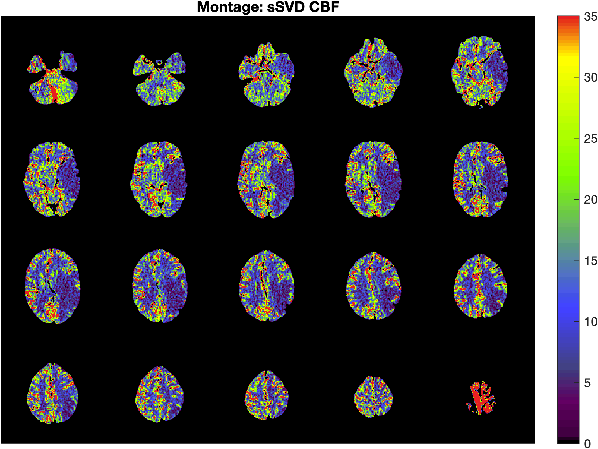
- **cSVD:**  
  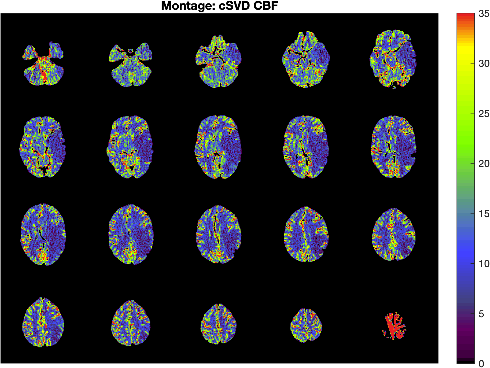

#### CBV
- **sSVD:**  
  
- **cSVD:**  
  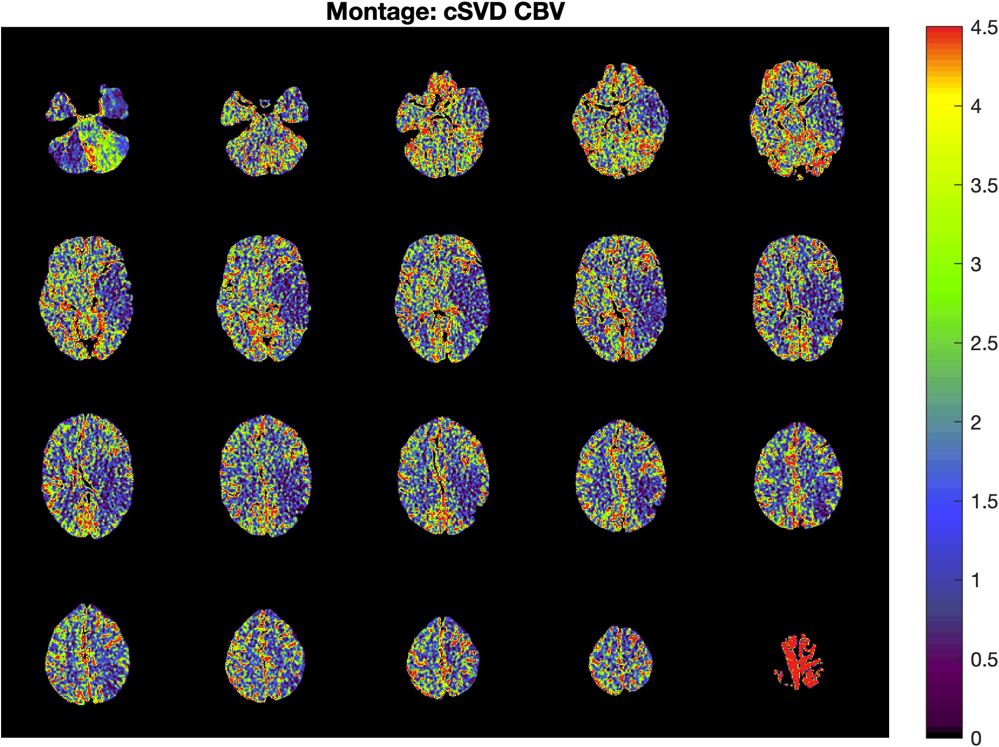

#### MTT
- **sSVD:**  
  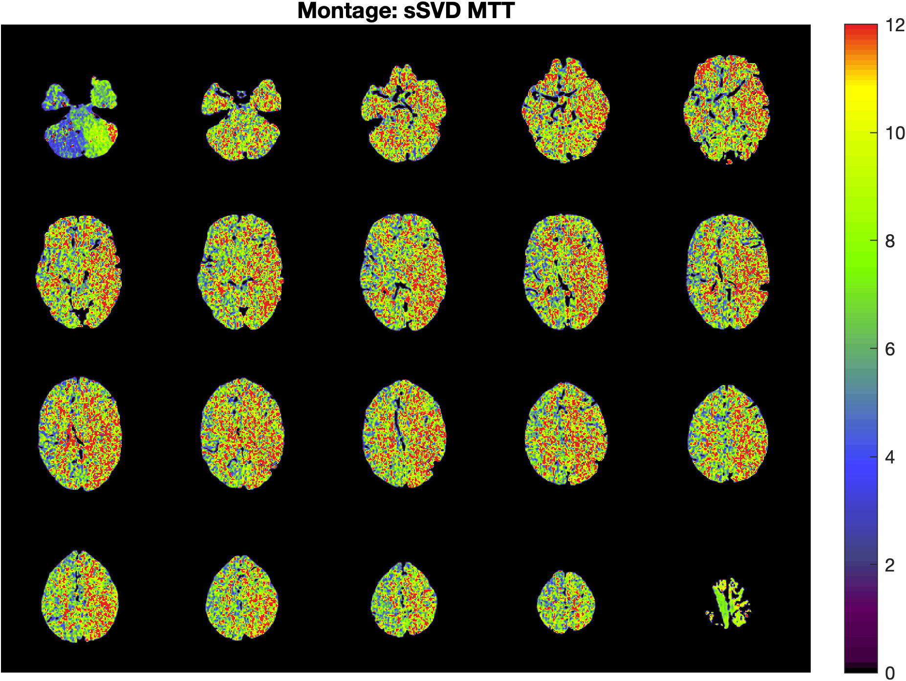
- **cSVD:**  
  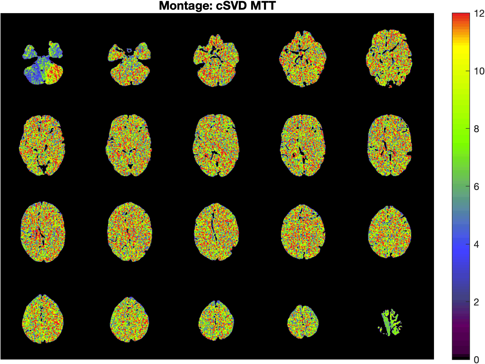

#### TMAX
- **sSVD:**  
  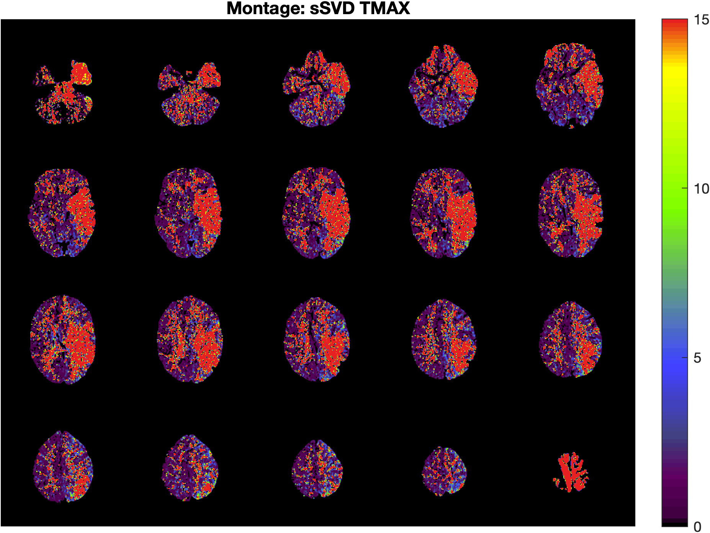
- **cSVD:**  
  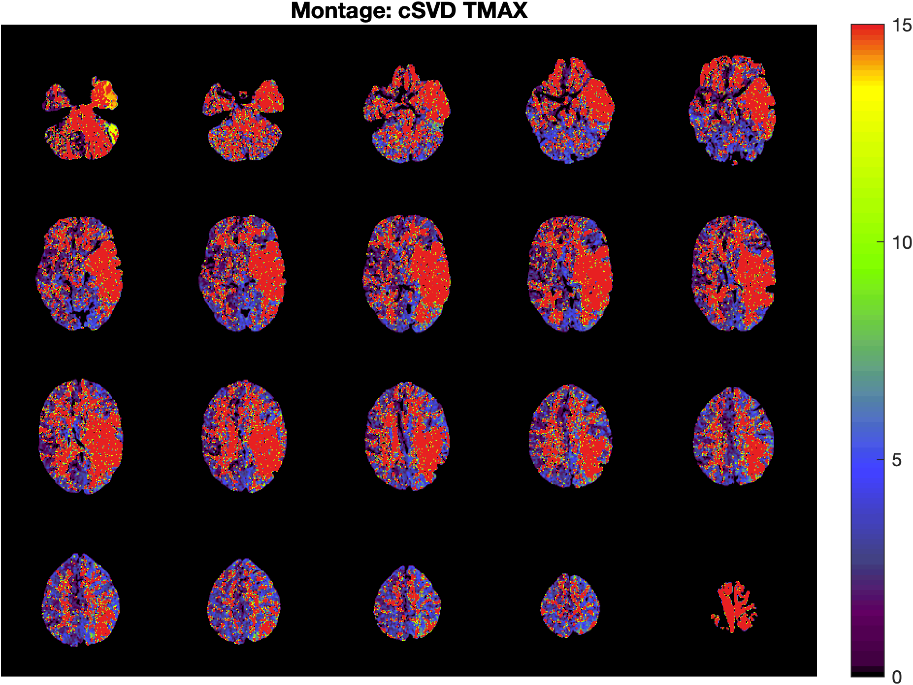

## References

[1] M. Najm et al., “Automated brain extraction from head CT and CTA images using convex optimization with shape propagation,” *Computer Methods and Programs in Biomedicine*, vol. 176, pp. 1–8, Jul. 2019, doi: 10.1016/j.cmpb.2019.04.030.  
[2] A. Fieselmann, M. Kowarschik, A. Ganguly, J. Hornegger, and R. Fahrig, “Deconvolution-Based CT and MR Brain Perfusion Measurement: Theoretical Model Revisited and Practical Implementation Details,” *International Journal of Biomedical Imaging*, vol. 2011, pp. 1–20, 2011, doi: 10.1155/2011/467563.  
[3] K. Mouridsen, S. Christensen, L. Gyldensted, and L. Østergaard, “Automatic selection of arterial input function using cluster analysis,” *Magnetic Resonance in Med*, vol. 55, no. 3, pp. 524–531, Mar. 2006, doi: 10.1002/mrm.20759.  
[4] Y.-H. Kao et al., “Automatic measurements of arterial input and venous output functions on cerebral computed tomography perfusion images: A preliminary study,” *Computers in Biology and Medicine*, vol. 51, pp. 51–60, Aug. 2014, doi: 10.1016/j.compbiomed.2014.04.015.  
[5] L. Østergaard et al., “High resolution measurement of cerebral blood flow using intravascular tracer bolus passages. Part I: Mathematical approach and statistical analysis,” *Magnetic Resonance in Med*, vol. 36, no. 5, pp. 715–725, Nov. 1996, doi: 10.1002/mrm.1910360510.  
[6] O. Wu et al., “Tracer arrival timing‐insensitive technique for estimating flow in MR perfusion‐weighted imaging using singular value decomposition with a block‐circulant deconvolution matrix,” *Magnetic Resonance in Med*, vol. 50, no. 1, pp. 164–174, Jul. 2003, doi: 10.1002/mrm.10522.  
[7] Fang, R. (n.d.). *pct: CT Perfusion Toolbox [Source code]*. GitHub. Retrieved March 7, 2025, from [https://github.com/ruogufang/pct](https://github.com/ruogufang/pct)  
[8] Marco Castellaro et al., *dsc-mri-toolbox*, GitHub repository. Retrieved from [https://github.com/marcocastellaro/dsc-mri-toolbox](https://github.com/marcocastellaro/dsc-mri-toolbox)

## Extended Documentation

For detailed information on each function and the underlying methodology, please refer to the inline documentation within the MATLAB code.

## Contributing

Contributions, improvements, and suggestions are welcome! Please fork this repository and submit a pull request, or open an issue for discussion.

## License

This project is licensed under the [MIT License](LICENSE).


